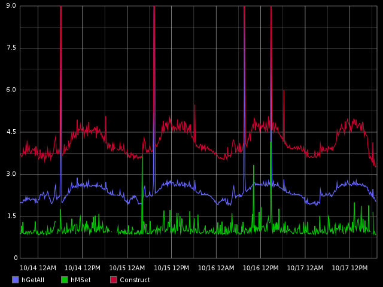
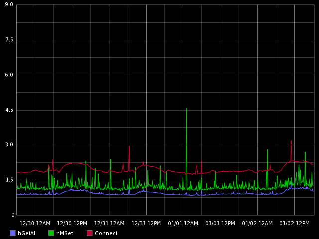
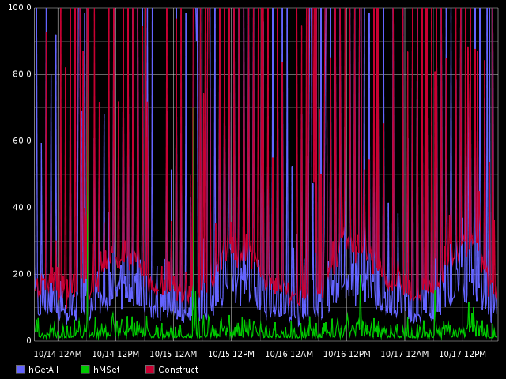
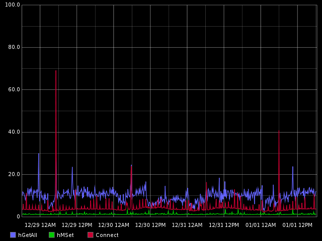

# Production Graphs #
Rmux has been in production at Pardot since October.  We have not had any issues with it in this time.  It slightly improved, and smoothed out our upper_90th percentile connection and response times
- Before: 
- 
- After: 
- 
====
Our Upper connection times saw a more drastic increase:
- Before: 
- 
- After: 
- 

Graphs will be added for pubsub side-effects, once we have finished rolling it out.
